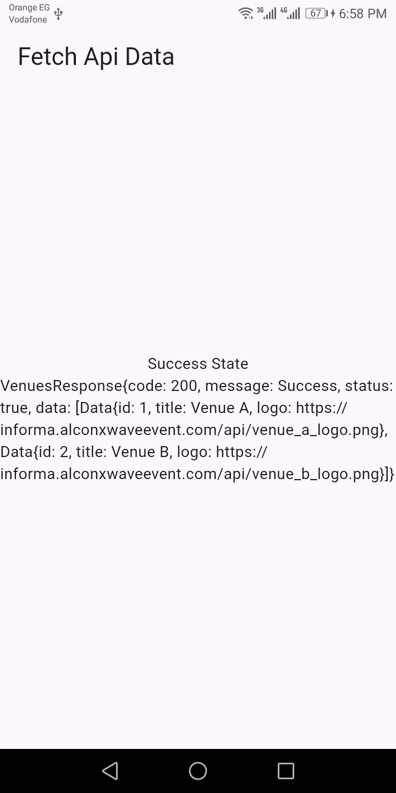
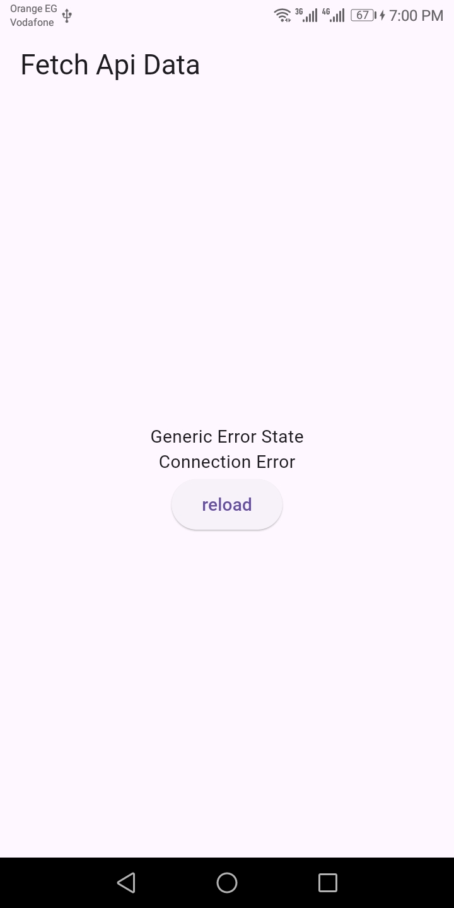

# Fetch API Cubit

A Flutter code snippet demonstrating how to fetch data from an API using Cubit for state management.

## Overview

This code snippet includes:

- Definition of `ApiFetchCubit` using Flutter Bloc for state management.
- Fetching data from an API endpoint using Dio.
- Handling different UI states (`inProgress`, `success`, `genericError`, `invalidCredentialsError`).

## Screenshots

| inProgress  | success  | genericError/invalidCredentialsError |
|:------------------------------------:|:------------------------------------:|:------------------------------------:|
|  |  |  |
